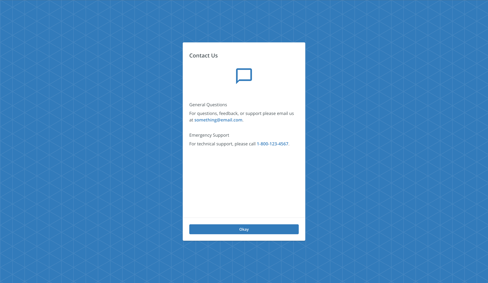

# Contact Support

The `<ContactSupport>` component is used to display the support information needed by user.



## Usage

```tsx
import { ContactSupport } from '@brightlayer-ui/react-auth-workflow';

<ContactSupport />
```

## API

<div style="overflow: auto">

| Prop Name                             | Description                                               | Type                                                              | Required | Default                                                                       |
| ------------------------------------- | --------------------------------------------------------- | ----------------------------------------------------------------- | -------- | ----------------------------------------------------------------------------- |
| title                                 | The text to show in the header                            | `string`                                                          | no       | "Contact Us"                                                                  |
| TitleProps                            | Props to pass to `title`                                  | `TypographyProps`                                                 | no       |                                                                               |
| Actions                               | Actions to display inside `CardActions`                   | `JSX.Element\|JSX.Element[]`                                      | no       | `<Button>Okay</Button>`                                                       |
| divider                               | Optional divider which appears above `Actions`            | `boolean`                                                         | no       | `true`                                                                        |
| ContactSupportContent                 | Element to display the contact support content            | `JSX.Element`                                                     | no       | `<CardContent>...</CardContent>`                                              |
| CardHeaderProps                       | Props to pass to `CardHeader`                             | `CardHeaderProps`                                                 | no       |                                                                               |
| CardContentProps                      | Props to pass to `CardContent`                            | `CardContentProps`                                                | no       |                                                                               |
| CardActionsProps                      | Props to pass to `CardActions`                            | `CardActionsProps`                                                | no       |                                                                               |
| phoneNumber                           | The text to override contact phone number                 | `string`                                                          | no       | "1-800-123-4567"                                                              |
| emailId                               | The text to override contact email id                     | `string`                                                          | no       | "something@email.com"                                                         |
| contactSupportQuestion                | The text to override contact support question             | `string`                                                          | no       | "General Questions"                                                           |
| contactSupportMessage                 | The text to override contact support message              | `string`                                                          | no       | "For questions, feedback, or support please email us at something@email.com." |
| contactSupportEmergency               | The text to override contact support emergency support    | `string`                                                          | no       | "Emergency Support"                                                           |
| contactSupportTechnicalAssistance     | The text to override contact support technical assistance | `string`                                                          | no       | "For technical support, please call 1-800-123-4567."                          |
| ContactSupportIcon                    | A component to render the icon                            | `ReactNode`                                                       | no       | `<ChatBubbleOutline />`                                                       |
| hiddenElements                        | Props to hide various elements of the component           | `ContactSupportHiddenElements`                                    | no       | {}                                                                            |
| classes                               | Style overrides                                           | `ContactSupportClasses`                                           | no       | {}                                                                            |
| slots                                 | Prop used for each slot in `ContactSupport`               | `{cardHeader: React.ElementType; cardContent: React.ElementType}` | no       | {}                                                                            |
| slotProps                             | Props applied to each slot                                | `{cardHeader: CardHeaderProps; cardContent: CardContentProps}`    | no       | {}                                                                            |

</div>

### ContactSupportHiddenElements

ContactSupportHiddenElements is a prop used in the ContactSupport component to control the visibility of various elements within the component. To use ContactSupportHiddenElements, simply pass an object with the keys corresponding to the elements you want to hide set to true. If a key is not present or is set to false, the corresponding element will be visible.

#### Available Keys

The following keys can be used within the ContactSupportHiddenElements object:

| Key Name                            | Description                                                             |
| ----------------------------------- | ----------------------------------------------------------------------- |
| `title`                             | Hides the title of the contact support component.                       |
| `contactSupportContent`             | Hides the main content of the contact support component.                |
| `contactSupportIcon`                | Hides the contact support icon.                                         |
| `contactSupportQuestion`            | Hides the general questions text.                                       |
| `contactSupportMessage`             | Hides the contact support message.                                      |
| `contactSupportEmergency`           | Hides the emergency support text.                                       |
| `contactSupportTechnicalAssistance` | Hides the technical assistance text.                                    |
| `actions`                           | Hides the actions (e.g., buttons) within the contact support component. |

#### Example

Here's an example of how to use the ContactSupportHiddenElements prop to hide the title and actions in the ContactSupport component:

```import { ContactSupport } from '...';

const App = () => (
    <ContactSupport
      hiddenElements={{
        title: true,
        actions: true
      }}
    />
);
```

In this example, the ContactSupport component will be rendered without the title and actions (e.g., buttons). The other elements will remain visible as their corresponding keys are not set to true in the hiddenElements object.

### Style Overrides

You can override the default styles used by Brightlayer UI by:

-   using the `sx` prop
-   passing a `classes` prop with keys from the Name column below
-   using the Global CSS Class in your main stylesheet

<p>For more details on styling options check out our <a href={`https://github.com/etn-ccis/blui-react-component-library/blob/master/docs/src/shared/markdown/StyleOverridesGuide.md`}>Styling Guide</a>.</p>

<Box>

| Name        | Global CSS Class                | Description                                 |
| ----------- | ------------------------------- | ------------------------------------------- |
| cardHeader  | .BluiContactSupport-cardHeader  | Styles applied to the card header element   |
| cardContent | .BluiContactSupport-cardContent | Styles applied to the card content element  |
| cardActions | .BluiContactSupport-cardActions | Styles applied to the card actions element  |

</Box>