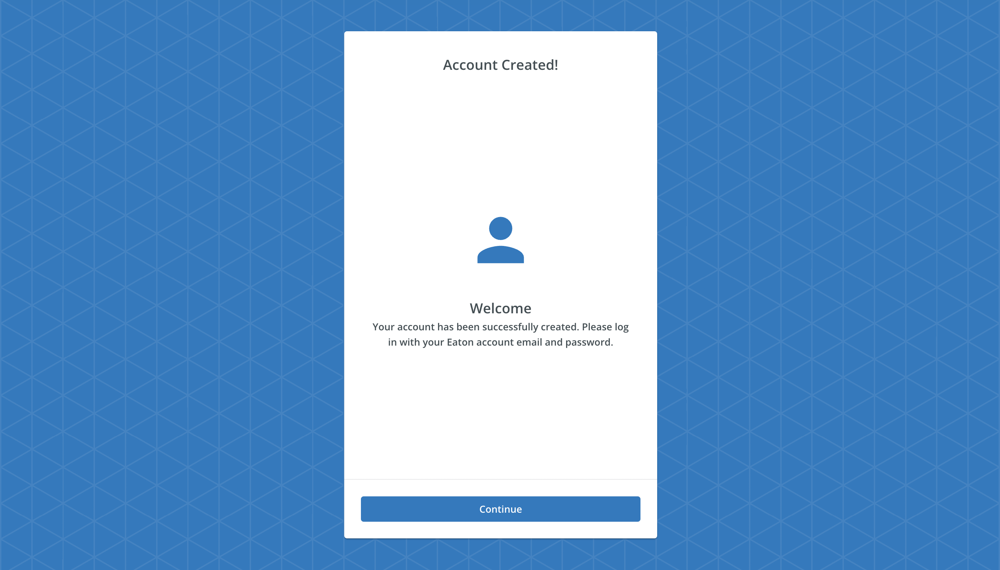

# ExistingAccountRegisterSuccessSubscreen

The `<ExistingAccountRegisterSuccessSubscreen>` component is used to display message, when user trying to register an account which is already exists.



## Usage

```tsx
import { ExistingAccountRegisterSuccessSubscreen } from '@brightlayer-ui/react-auth-workflow';

<ExistingAccountRegisterSuccessSubscreen />;
```

## API

<div style="overflow: auto">

| Prop Name    | Description                             | Type                         | Required | Default                                                                                                 |
| ------------ | --------------------------------------- | ---------------------------- | -------- | ------------------------------------------------------------------------------------------------------- |
| cardTitle    | Text to show in the header              | `string`                     | no       | "Account Craeted!"                                                                                      |
| messageIcon  | Display icon in the message             | `JSX.Element`                | no       | `<Person color={'primary'} sx={{ fontSize: 100, mb: 2 }} />`                                            |
| messageTitle | Text to show in the message title       | `string`                     | no       | "Welcome"                                                                                               |
| messageBody  | Text to display as message              | `string`                     | no       | "Your account has been successfully created. Please log in with your Eaton account email and password." |
| cardActions  | Actions to display inside `CardActions` | `JSX.Element\|JSX.Element[]` | no       | `<Button>Continue</Button>`                                                                             |

</div>

## Example

Here's an example of how to use the ExistingAccountRegisterSuccessSubscreen.

```tsx
import { ExistingAccountRegisterSuccessSubscreen } from '@brightlayer-ui/react-auth-workflow';

const App = () => <ExistingAccountRegisterSuccessSubscreen />;
```
