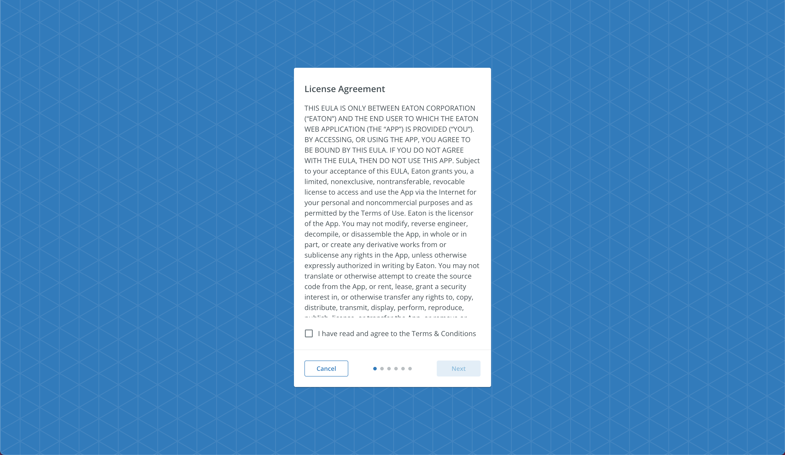

# View Eula Subscreen

The `<ViewEulaSubscreen>` component that renders a screen displaying the EULA and requests acceptance via a checkbox.



## Usage

```tsx
import { useState } from 'react';
import { ViewEulaSubscreen } from '@brightlayer-ui/react-auth-workflow';

const [eulaAccepted, setEulaAccepted] = useState(false);

<ViewEulaSubscreen 
    eulaAccepted={eulaAccepted} 
    onEulaCheckboxChanged={setEulaAccepted} 
    loadEulaAction={()=>{ // ...Load the Eula if we do not yet have the content }} 
/>
```

## API

<div style="overflow: auto">

| Prop Name                | Description                                                                  | Type                                                                                            | Required | Default                                           |
| ------------------------ | -----------------------------------------------------------------------------| ------------------------------------------------------------------------------------------------| -------- | ------------------------------------------------- |
| eulaAccepted             | Check for the checkbox to accept eula terms and conditions                   | `boolean`                                                                                       | yes      |                                                   |
| onEulaCheckboxChanged    | Function to call when the state of the checkbox is changed                   | `function`                                                                                      | yes      |                                                   |
| loadEulaAction           | Function which when called returns promise to retrieve eula content or error | `function`                                                                                      | yes      | "Loading End User License Agreement..."           |
| htmlEula                 | Allow the EULA to be displayed as HTML or Text                               | `boolean`                                                                                       | no       |                                                   |
| eulaError                | Error message if the EULA fails to load                                      | `string`                                                                                        | no       |                                                   |
| agreeTerms               | Overrides terms and conditions checkbox label                                | `string`                                                                                        | no       | "I have read and agree to the Terms & Conditions" | 
| classes                  | Style overrides                                                              | `ViewEulaSubscreenClasses`                                                                      | no       |                                                   |
| slots                    | Prop used for each slot in `ViewEulaSubscreen`                               | `{loader: React.ElementType; eulaContent: React.ElementType; checkboxLabel: React.ElementType}` | no       | {}                                                |
| slotProps                | Props applied to each slot                                                   | `{loader: any; eulaContent: BoxProps; checkboxLabel: FormControlLabelProps}`                    | no       | {}                                                |

</div>

### Style Overrides

You can override the default styles used by Brightlayer UI by:

-   using the `sx` prop
-   passing a `classes` prop with keys from the Name column below
-   using the Global CSS Class in your main stylesheet

<p>For more details on styling options check out our <a href={`https://github.com/etn-ccis/blui-react-component-library/blob/master/docs/src/shared/markdown/StyleOverridesGuide.md`}>Styling Guide</a>.</p>

<Box>

| Name               | Global CSS Class                          | Description                                     |
| ------------------ | ----------------------------------------- | ----------------------------------------------- |
| loader             | .BluiViewEulaSubscreen-loader             | Styles applied to the loader element            |
| eulaContent        | .BluiViewEulaSubscreen-eulaContent        | Styles applied to the eula content element      |
| termsAndConditions | .BluiViewEulaSubscreen-termsAndConditions | Styles applied to the terms and content element |

</Box>
