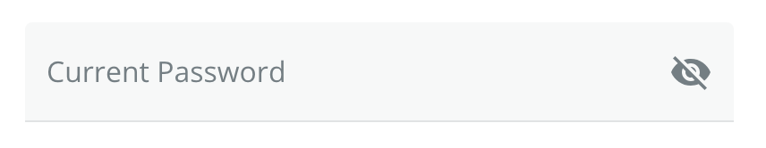

# PasswordTextField

Component that renders a text field with a visibility toggle.



## Usage

```tsx
import { PasswordTextField } from '@brightlayer-ui/react-auth-workflow';

...

<PasswordTextField/>
```

## API

See MUI [TextFieldProps](https://mui.com/components/text-fields/).

