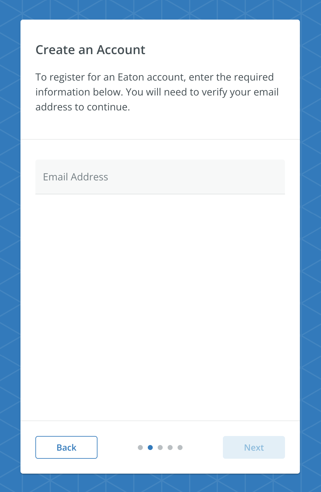

# CreateAccountScreen

A screen that displays a text field to collect the user's email address. The CreateAccountScreen must be used within a `RegistrationContextProvider`.



## Usage

```tsx
import { RegistrationContextProvider, CreateAccountScreen } from '@brightlayer-ui/react-auth-workflow';

...

<RegistrationContextProvider {...props}>
    <CreateAccountScreen />
</RegistrationContextProvider>
```

## API

| Prop Name | Type | Description | Default |
|---|---|---|---|
| emailLabel | `string` | Text to display as the label for the email text field. | `t('bluiAuth:CREATE_ACCOUNT.EMAIL_ADDRESS')` |
| initialValue | `string` | The initial value for the email text field. |  |
| emailValidator | `(email: string) => boolean \| string` | A function that validates the email text field input. | checks against valid email regex |
| emailTextFieldProps | `TextFieldProps` | Props to pass to the MUI [TextField](https://mui.com/material-ui/api/text-field/) component. |  |
| errorDisplayConfig | `ErrorManagerProps` | See [Error Management](https://github.com/etn-ccis/blui-react-workflows/tree/master/login-workflow/docs/error-management.md) |  |

This screen also extends the `WorkflowCardProps` type for updating the title, instructions, buttons, etc. See [Workflow Card](https://github.com/etn-ccis/blui-react-workflows/tree/master/login-workflow/docs/components/workflow-card.md) for more details.