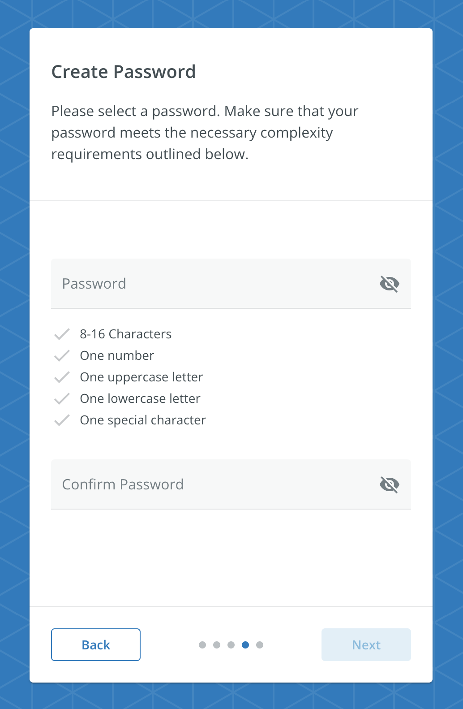

# CreatePasswordScreen

A screen that displays text fields to create a new user's password. The CreatePasswordScreen must be used within a `RegistrationContextProvider`.



## Usage

```tsx
import { RegistrationContextProvider, CreatePasswordScreen } from '@brightlayer-ui/react-auth-workflow';

...

<RegistrationContextProvider {...props}>
    <CreatePasswordScreen />
</RegistrationContextProvider>
```

## API

| Prop Name | Type | Description | Default |
|---|---|---|---|
| PasswordProps | `SetPasswordProps` | See [Set Password](../components/set-password.md) |  |
| errorDisplayConfig | `ErrorManagerProps` | See [Error Management](../error-management.md) |  |

This screen also extends the `WorkflowCardProps` type for updating the title, instructions, buttons, etc. See [Workflow Card](../components/workflow-card.md) for more details.