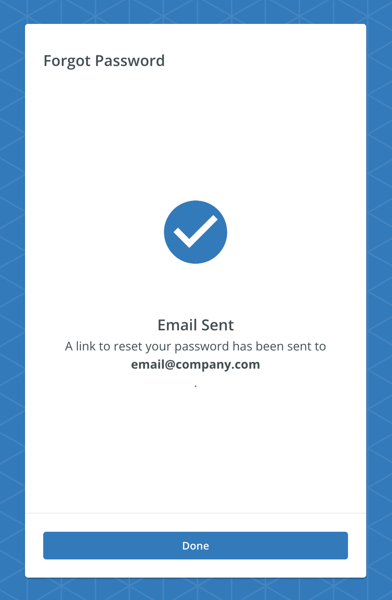

# SiteOptionsScreen

A component to use for DERMS Auth workflow. It renders a message, an icon, and two buttons named `Create a New Organization` and `Join Existing Organization`.

<!-- TODO: This needs to be updatd in Full screen story -->
<!-- 

## Usage

```tsx
import { SiteOptionsScreenBase } from '@brightlayer-ui/react-auth-workflow';

...

<SiteOptionsScreen  /> -->
```

## API

| Prop Name | Type | Description | Default |
|---|---|---|---|
| icon | `React.ReactNode` | The icon to be displayed on the screen. |  |
| message | `ReactNode` | The success message to be displayed on the screen. |  |
| createNewOrgLabel | `string` | label for the custom button which redirects to create a new organization flow. |  |
| joinExistingOrgLabel | `string` | The label for the custom button. Which redirects to the existing organization flow. |  |
| onCreateNewOrg | `() => void` | A function to be called when the previous button is clicked. |  |
| onJoinExistingOrg | `() => void` | A function to be called when the next button is clicked. |  |

This screen also extends the `WorkflowCardProps` type for updating the title, instructions, buttons, etc. See [Workflow Card](../components/workflow-card.md) for more details.
  